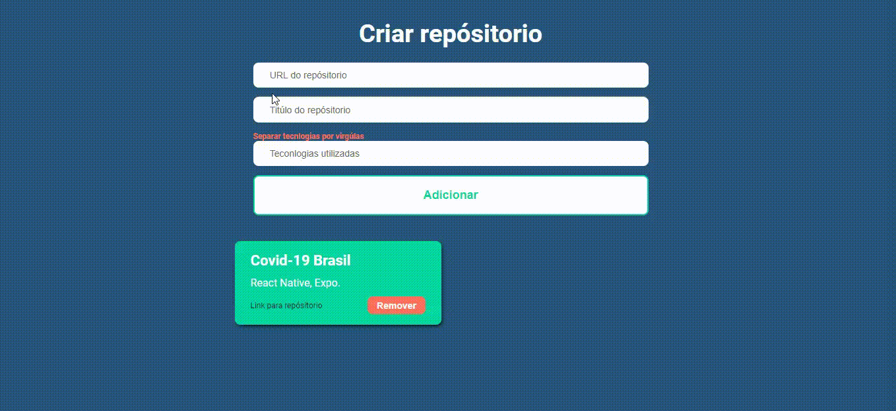

<div align="center">
  

  ## Desafio 04: Conceitos do ReactJS
</div>


<div align="center">
  
</div>

## 🔖 Sobre

Aplicação feita durante o defaio 04 do bootcamp da Rocketseat para fixar conceitos do React. App consiste em cadastrar o repósitorio com o link e as tecnológias utlizadas, além disso lista de deleta repósitorios.

## 📁 Repósitorios relacionados
- [Backend](https://github.com/netohelvecio/desafio-conceitos-nodejs)
- Mobile - Ainda em construção.

## 💻: Tecnologias utilizadas

- axios
- react

## 📂 Como baixar o projeto

```bash
  # Clonar repositório
  $ git clone https://github.com/netohelvecio/desafio-conceitos-reactjs

  # Entrar na pasta do repositório
  $ cd desafio-conceitos-reactjs

  # Instalar dependências
  $ yarn

  # Antes de iniciar o projeto é importante ter o backend rodando (link do repósitorio acima).

  # Inicar projeto
  $ yarn start

  # Rodar testes
  $ yarn test
```

---

Desenvolvido por Helvécio Neto
